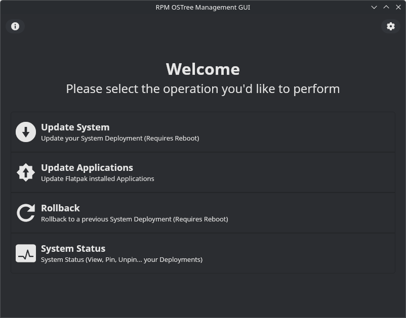

   
  
  <h1>RPM OSTree (ROT) Management GUI</h1>

  
  

  <h3>GUI to manage RPMOSTree Systems (Such as Silverblue or Kinoite)</h3>

  
  

## Notes

> [!WARNING]
> For this app to work correctly you MUST disable automatic updates on GNOME Software/KDE Software Update...
>
> You can check this in GNOME Software > Preferences or KDE Settings > Software Update
> In Bazzite/UBlue distros it seems you can use `ujust _toggle-updates` (Check: https://github.com/ublue-os/bazzite/issues/2592)

> [!CAUTION]
> This app has been tested on Fedora Silverblue and Kinoite; efforts to make it work correctly on Bazzite... are being made; however, for now system updates can't be performed on Bazzite since `rpm-ostree upgrade --check` seems to not work reliably. 
> Also, considering Bazzite... provide their own tools to handle updates comfortably I'm wondering if trying to support Bazzite... is a good idea in the first place.

Key features are:

- Update your System
- Update your Flatpak applications
- Rollback your system in case anything goes wrong
- Pin and Unpin deployments, view all your deployments...

This project is being developed to help people who are not that experienced with Linux and the CLI manage their atomic systems. I know that Gnome Software has "full" integration with RPM OSTree; however, in my personal experience, Gnome Software is not that reliable nor fast on Fedora Silverblue (also, there are some missing options...), hence why I considered developing this tool. This software is not and will never be a full replacement for Gnome Software. I just want people to be able to interact with RPM OSTree and keep both their system and packages updated...

Special thanks to Simon and Catalina for their patience and confidence to switch their machines from Windows to Fedora Silverblue and for the idea and motivation for this project.

## TODO

- Upgrading Between Major Versions (https://docs.fedoraproject.org/en-US/fedora-silverblue/updates-upgrades-rollbacks/#upgrading)

## Attributions

> "[Pop Icons](http://github.com/pop-os/icon-theme)" by [System76](http://system76.com/) is licensed under [CC-SA-4.0](http://creativecommons.org/licenses/by-sa/4.0/)

> Application Icon from [SVGRepo](https://www.svgrepo.com/svg/475104/chief-hat) made by [Yu-Chun Chou](https://www.svgrepo.com/author/Yu-Chun%20Chou/) (colors modified by myself).

## About me

Check out my [other projects](https://github.com/mariinkys) 

You can also help do this and more projects, [Buy me a coffee](https://www.buymeacoffee.com/mariinkys)

## Copyright and Licensing

Copyright 2025 © Alex Marín

Released under the terms of the [GPL-3.0](https://github.com/mariinkys/rot-management-gui/blob/main/LICENSE)
