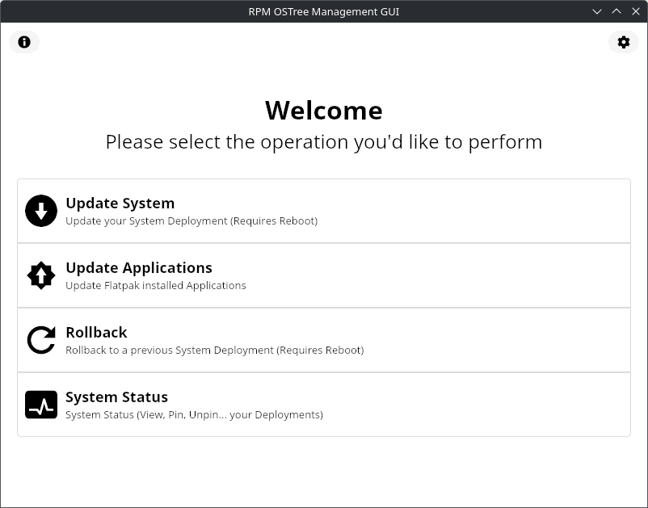

   
  
  <h1>FA Management GUI</h1>

  
  

  <h3>GUI to manage RPM-OSTree Systems (Such as Silverblue or Kinoite)</h3>

  

## Notes

Key features are:

- Update your System
- Update your Flatpak applications
- Rollback your system in case anything goes wrong
- Pin and Unpin Images, view all your images...

## Attributions

> "[Pop Icons](http://github.com/pop-os/icon-theme)" by [System76](http://system76.com/) is licensed under [CC-SA-4.0](http://creativecommons.org/licenses/by-sa/4.0/)

## About me

Check out my [other projects](https://github.com/mariinkys) 

You can also help do this and more projects, [Buy me a coffee](https://www.buymeacoffee.com/mariinkys)

# Copyright and Licensing

Copyright 2025 © Alex Marín

Released under the terms of the [GPL-3.0](https://github.com/mariinkys/fa-management-gui/blob/main/LICENSE)
